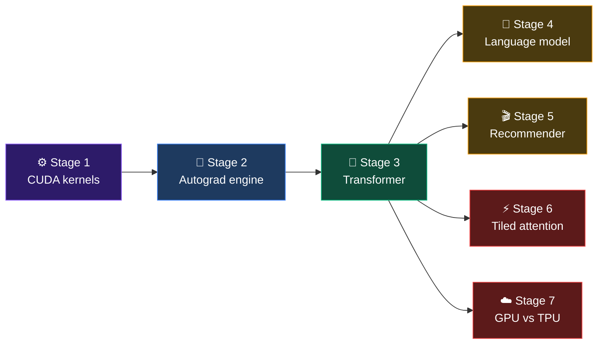
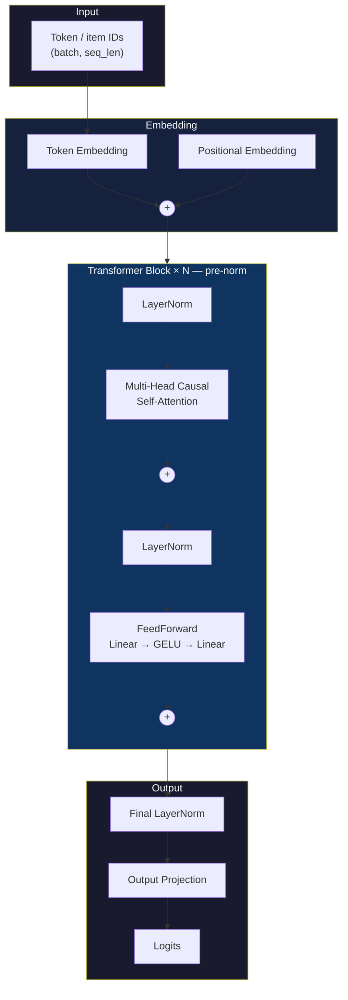
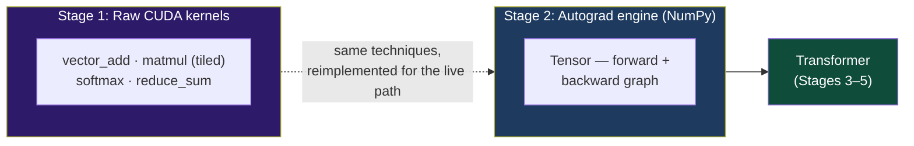

# CUDA Transformer Engine

**A transformer, built from raw CUDA kernels up. No PyTorch. No TensorFlow. No
JAX in the core math.** Every matmul, every backward pass, every line of
attention math — hand-written, GPU-verified, and trained end to end on two
completely different problems with the same unmodified architecture.

<p align="center">
  <b>🔥 25.7x faster attention</b> &nbsp;·&nbsp;
  <b>🧠 98% MNIST accuracy</b> &nbsp;·&nbsp;
  <b>📚 coherent text generation</b> &nbsp;·&nbsp;
  <b>🎬 movie recommendations</b> &nbsp;·&nbsp;
  <b>⚡ TPU beats GPU, 2.6x</b>
</p>

---

## The pitch

Most "built an AI project" portfolios are a config file pointed at someone
else's library. This one isn't. It starts at the CUDA kernel — threads,
blocks, shared memory, warp shuffles — and builds *up* through a hand-rolled
autograd engine to a full transformer, with nothing borrowed from a deep
learning framework for the core math.

Then it proves the engine actually works by training it twice, on two
unrelated problems, using **the exact same model class, unmodified**:

```
"The king walked into the forest..."          ← same decoder, word tokens
"users who liked Mulan will probably like..."  ← same decoder, movie tokens
```

That's the whole point. A next-word predictor and a next-movie recommender
are the same math problem wearing different labels — and this repo is the
proof, not just the claim.

## What's actually in here



| | Stage | What it proves |
|---|---|---|
| ⚙️ | [**1 — CUDA Kernels**](stage1/) | Hand-written vector add, tiled matmul, warp-shuffle softmax, tree-reduction sum — the building blocks, benchmarked CPU vs GPU |
| 🧮 | [**2 — Autograd Engine**](stage2/) | A `Tensor` class with a real backward pass, trains a 3-layer MLP to **98.00%** on MNIST — zero frameworks |
| 🤖 | [**3 — Transformer**](stage3/) | Multi-head causal attention, pre-norm residual blocks, built entirely on the Stage 2 engine |
| 📖 | [**4 — Language Model**](stage4/) | Trained on TinyStories — loss **3.40 → 1.69**, generates genuinely coherent completions |
| 🎬 | [**5 — Recommender**](stage5/) | *Same model class, zero architecture changes* — retrained on MovieLens 1M to predict the next movie someone watches |
| ⚡ | [**6 — Tiled Attention**](stage6/) | A from-scratch FlashAttention-style CUDA kernel — **25.7x faster**, 128 MB of memory never allocated |
| ☁️ | [**7 — GPU vs TPU**](stage7/) | Same architecture, JAX/Flax, raced on a Colab TPU v5e vs a T4 GPU — **TPU wins by 2.6x** |

**[→ Every number, every stage: BENCHMARKS.md](BENCHMARKS.md)**
**[→ How the kernels actually work: CUDA_OPTIMIZATIONS.md](CUDA_OPTIMIZATIONS.md)**

## See it work

**The language model**, prompted with *"The king walked into"*:

> *"the king walked into the forest. he was not scared of the lion. he was too
> scared to go away. the king saw the queen and wanted the best."*

**The recommender**, given a user's history of *A Bug's Life, Antz, The
Hunchback of Notre Dame, Hercules, Mulan*:

| Rank | Predicted next movie |
|---|---|
| 🥇 | The Lion King (1994) |
| 🥈 | The Sword in the Stone (1963) |
| 🥉 | The Swan Princess (1994) |

Same decoder. Same weights-from-scratch training loop. The only thing that
changed between these two outputs is what the integers in the vocabulary
stand for — see [the full argument](stage5_writeup.md) for why that's not a
coincidence.

## One architecture, two domains



This single class (`stage3/models/decoder_lm.py::DecoderLanguageModel`) is
reused **byte-for-byte unchanged** across Stages 4 and 5:

| | Stage 4: Language model | Stage 5: Recommender |
|---|---|---|
| Vocabulary | 2,000 words (TinyStories) | 3,710 movie IDs (MovieLens 1M) |
| A "sequence" is | a sentence | one user's watch history, in order |
| Predicts | the next word | the next movie |

## The numbers that matter

| Metric | Result |
|---|---|
| MNIST test accuracy | **98.00%** (hand-written Adam, no framework) |
| Language model loss | 3.40 → **1.69** over 15 epochs |
| Recommender loss | 6.46 → **4.20** over 15 epochs, 1M interactions |
| Tiled attention vs dense, seq=1024 | **25.7x faster**, 128 MB memory avoided |
| TPU v5e vs Tesla T4 training | **2.6x faster**, same code, only hardware changed |
| TPU vs this project's own CPU engine | **~128x faster** |

Every number above is measured, not estimated — most on real GPU/TPU hardware
via Google Colab, since the development machine has neither. Full receipts:
**[BENCHMARKS.md](BENCHMARKS.md)**.

## How the engine is actually wired



The Stage 1/2 CUDA kernels are a standalone, GPU-benchmarked deliverable — they
prove the operations are correct and fast on real hardware. The engine that
actually *trains* every model in Stages 2–5 (`stage2/tensor.py`) is pure
NumPy, which is why this entire project — MNIST, the language model, the
recommender — trains on a machine with no NVIDIA GPU at all. Stage 6's tiled
attention kernel is the one place the two paths are verified against each
other directly: the CUDA kernel's output is checked to match the live NumPy
model's attention, element for element, before it's benchmarked.

## Run it

```bash
# Stage 2 — train the MNIST MLP from scratch (CPU, ~30s)
python3 train_mnist.py

# Stage 4 — generate text from the trained language model
python3 generate.py --prompt "The king walked into"

# Stage 5 — get a movie recommendation from the trained model
python3 recommend.py --user-id 1
```

Every stage has its own `README.md` with the goal, what was built, how to run
it, and real results — start with [stage1/](stage1/) and follow the links
forward, or jump straight to whichever stage interests you.

## Repo map

```
cudatransformer/
├── stage1/   ⚙️  CUDA kernel fundamentals
├── stage2/   🧮  Autograd engine + MNIST
├── stage3/   🤖  Transformer decoder
├── stage4/   📖  Language model (TinyStories)
├── stage5/   🎬  Recommender (MovieLens 1M)
├── stage6/   ⚡  Tiled attention (FlashAttention-style)
├── stage7/   ☁️  GPU vs TPU (JAX/Flax)
├── BENCHMARKS.md          every measured number, one place
└── CUDA_OPTIMIZATIONS.md  why each kernel is written the way it is
```

## The rules this project held itself to

- **No PyTorch / TensorFlow / JAX for the core math.** The one deliberate
  exception is Stage 7, which exists specifically to compare GPU vs TPU
  training — CUDA kernels can't run on a TPU, so JAX is the only way to make
  that comparison fairly, and it's fenced off in its own requirements file.
- **Every benchmark is measured, not approximated**, on real hardware —
  mostly Google Colab, since the dev machine has no NVIDIA GPU or TPU. The one
  gap ([Stage 1's GPU numbers](stage1/README.md#estimated-gpu-speedup-not-measured--see-above),
  blocked on Colab quota) is labeled as an estimate, not dressed up as real.
- **One stage at a time, each with a working deliverable**, before the next
  one starts.
