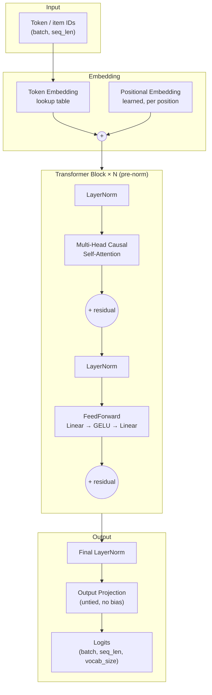
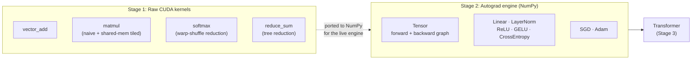

# CUDA Transformer Engine

A transformer built from the CUDA kernel level up — no PyTorch, TensorFlow, or JAX
in the core math. The same architecture is trained end to end on two different
domains (language and recommendation) to prove the engine generalizes, then
benchmarked against a hand-written GPU attention kernel and a JAX/TPU
reimplementation for comparison.

```
Raw CUDA kernels  ->  Autograd engine  ->  Transformer  ->  Two trained applications
   (Stage 1)           (Stage 2)          (Stage 3)         (Stage 4, Stage 5)
```

## Why this exists

Most portfolio projects call an existing library and fine-tune a model. This
project shows what happens underneath: memory layout, thread/block scheduling,
backward passes, and attention math, all written by hand. The two application
demos at the end (language modeling, recommendation) prove the engine is
general — not a one-off script, but a reusable architecture where swapping the
*meaning* of the input integers is the only thing that changes between tasks.

## Architecture



The same `DecoderLanguageModel` class (`stage3/models/decoder_lm.py`) is reused,
**completely unchanged**, for both applications:

| | Stage 4: Language model | Stage 5: Recommender |
|---|---|---|
| Vocabulary | 2,000 words (TinyStories) | 3,710 movie IDs (MovieLens 1M) |
| Sequence = | a sentence | one user's watch history, in order |
| Predicts | the next word | the next movie |

Swapping domains only required changing what the integers *mean* and how
sequences are segmented — see [`stage5_writeup.md`](stage5_writeup.md) for the
full argument that next-token and next-item prediction are the same task.

## Engine internals



**Important nuance:** the Stage 1/2 CUDA kernels are a standalone, benchmarked
deliverable proving the operations work correctly and fast on a GPU — they are
**not** wired into the live training path. The `Tensor` engine that actually
trains the models (`stage2/tensor.py`) is pure NumPy, so every model in Stages
2–5 trains on CPU. This is why training runs on a GPU-less machine, and why the
CUDA kernels are benchmarked separately (see [BENCHMARKS.md](BENCHMARKS.md)).
Stage 6's tiled-attention CUDA kernel is the one exception that was also
verified against the live NumPy attention path for correctness.

## Results at a glance

| Stage | Deliverable | Headline result |
|---|---|---|
| [1](stage1/) | CUDA kernel benchmarks | 4 kernels (vector add, matmul, softmax, reduction), CPU vs GPU |
| [2](stage2/) | Autograd engine + MNIST MLP | **98.0%** test accuracy, trained with hand-written Adam |
| [3](stage3/) | Transformer decoder | Full fwd/bwd pass verified, 94.4% synthetic-task accuracy |
| [4](stage4/) | Tiny language model | Loss 3.40 → **1.69**, coherent TinyStories completions |
| [5](stage5/) | Sequential recommender | Same architecture, loss 6.46 → **4.20** on MovieLens 1M |
| [6](stage6/) | Tiled attention (FlashAttention-style) | **25.7x** faster than dense attention at seq_len=1024 on a T4 |
| [7](stage7/) | GPU vs TPU training (JAX/Flax) | TPU v5e **2.6x** faster than T4, **128x** faster than our CPU engine |
| [8](#stage-8-polish) | Polish & documentation | This file, plus per-stage docs, diagrams, and a benchmark roll-up |

Full numbers for every stage: **[BENCHMARKS.md](BENCHMARKS.md)**.
CUDA kernel design notes: **[CUDA_OPTIMIZATIONS.md](CUDA_OPTIMIZATIONS.md)**.

## Repo layout

```
cudatransformer/
├── stage1/        CUDA kernel fundamentals (vector add, matmul, softmax, reduction)
├── stage2/        Autograd engine (Tensor, layers, optimizers) + MNIST MLP
├── stage3/        Transformer decoder (attention, embeddings, blocks)
├── stage4/        Tiny language model, trained on TinyStories
├── stage5/        Sequential recommender, trained on MovieLens 1M
├── stage6/        Simplified tiled attention, CUDA kernel + benchmarks
├── stage7/        JAX/Flax reimplementation for GPU vs TPU comparison
├── BENCHMARKS.md          All measured numbers, one place
├── CUDA_OPTIMIZATIONS.md  Why each kernel is written the way it is
└── *_results.txt          Raw output from each stage's benchmark/training run
```

Each `stageN/` folder has its own `README.md` with that stage's goal, what was
built, how to run it, and a link to its results file.

## Running it yourself

Everything in Stages 1–6 is pure Python + NumPy (no GPU required) except the
CUDA kernel builds, which need `nvcc` (the GPU-only numbers in this repo were
produced on Google Colab — see each stage's `COLAB_README.md` where present).

```bash
# Stage 2: train the MNIST MLP (CPU, ~30s)
python3 train_mnist.py

# Stage 4: train the tiny language model (CPU, ~2hr) or generate from the checkpoint
python3 generate.py

# Stage 5: get a recommendation from the trained checkpoint
python3 recommend.py
```

Stage 7 needs a separate environment (`requirements_stage7.txt`) since it's the
one place JAX is used, deliberately isolated from the NumPy-only constraint
everywhere else — see [stage7/README.md](stage7/README.md).

## Constraints this project holds itself to

- **No PyTorch / TensorFlow / JAX for the core math.** NumPy is fine for CPU
  comparisons and data loading. The one exception is Stage 7, which exists
  specifically to compare GPU vs TPU training — CUDA kernels can't run on a
  TPU, so JAX is the only way to make that comparison, and it's fenced off
  from the rest of the engine (separate requirements file, separate package).
- **Every benchmark number is measured, not estimated**, wherever hardware
  allowed it. Where a number couldn't be measured locally (no NVIDIA GPU or
  TPU on the development machine), it was measured on Google Colab instead —
  never approximated.
- **One stage at a time**, each with a working, verified deliverable before
  the next stage starts.

## Stage 8: Polish

This stage (the one you're reading the output of) added:
- This root README, with the architecture diagrams above
- A `README.md` in every `stageN/` folder
- [BENCHMARKS.md](BENCHMARKS.md) — every real number from every stage, in one table
- [CUDA_OPTIMIZATIONS.md](CUDA_OPTIMIZATIONS.md) — a walkthrough of the actual
  optimization techniques used in the kernels (shared-memory tiling, warp-shuffle
  reductions, coalesced access, online softmax) with references to the real code
- Repo cleanup: removed tracked `.pyc` files and unused data artifacts
- Closed a gap from Stage 1: its kernel benchmarks had never been run on a real
  GPU (`stage1_results.txt` showed `CUDA Available: False`) — added
  `stage1/colab_benchmark.py` and ran it on Colab to get real numbers, matching
  what Stages 2, 6, and 7 already had
